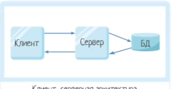
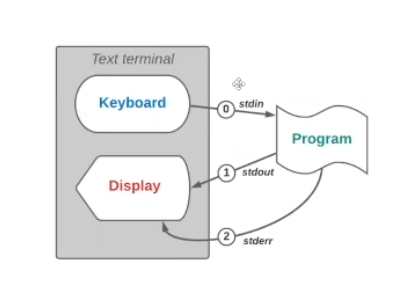

# Клиент-серверное взаимодействие

Клиент - Сервер

Взаимодействие двунаправленное, как на картинке

Для обмена данными между клиентами и сервером используются потоки (stream).

Не thread(поток исполнения), а stream (поток данных)

thread != stream

В нашем примере клиенты между собой не общаются.

Поток с которым мы уже знакомы, stdin - поток ввода (Read, ReadLine), stdout - поток вывода (Write, WtiteLine).

В одном пространстве имен(namespace) может находиться несколько классов. Класс аналог - типа данных.
namespace нужен для того чтобы можно было обращаться к классам из другого файла.

Для того чтобы одназначно определить кто есть кто у всех есть свои адреса - числа от 0 до 250.

IP адрес 127.0.0.1 - отправляет запрос на свой же компухтер. Отправляем запрос самому себе.
Необходимо еще указать порт. У одного IP адреса может быть несколько портов.

Необходимо постоянно держать подключение

